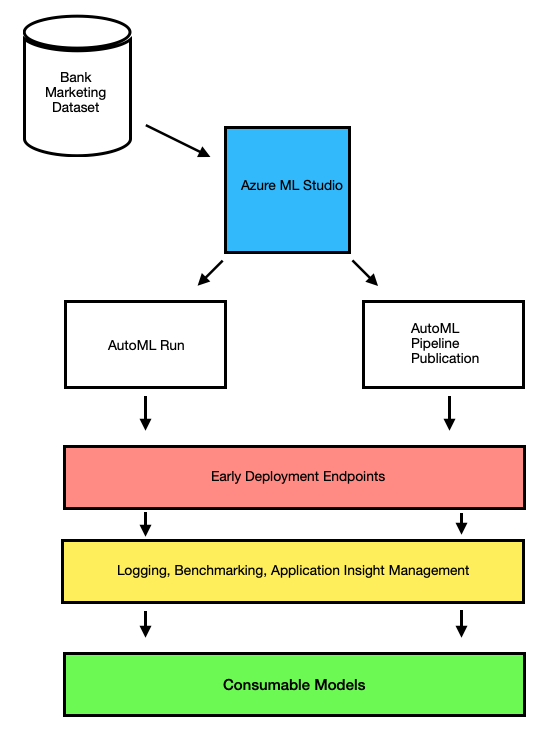

# Udacity Machine Learning Engineer with Microsoft Azure 2nd Project
This is the secone project for the Machine Learning Engineer with Microsoft Azure course from Udacity.

Course -> https://emc.udacity.com/c/optum/catalog/t/i/nd/nd00333

## Overview
This project is part of the Udacity Machine Learning Engineer with Microsoft Azure Nanodegree. The focus of this project is the full pipeline for a ML project from start to finish. This includes testing and running the model via AutoML, finding the best peforming model, deploying it as an endpoint and consuming it (using Swagger) with a big focus on monitoring/logging. All of this is accomplished in an automated fashion via code, so no point-and-click in the Azure Portal at this point. You are an MLOps Engineer, prove it!

The following diagram shows the project flow for both the first part and now the second part (this project) where steps are automated.

The dataset used in this project contains direct marketing data from financial institution's marketing campaign collected via telephone calls. The campaign's goal was an increase in subscribers. The main point of the model is determine if the user will subscribe (yes) or not (no). Thus, the predictor or Y is this decision.

Reference -> https://archive.ics.uci.edu/ml/datasets/bank+marketing

Dataset link -> https://automlsamplenotebookdata.blob.core.windows.net/automl-sample-notebook-data/bankmarketing_train.csv

Here is the data loaded into the ML workspace as a data asset.

The project consists of two main parts ...

Part 1:

- Create a Dataset from the bank marketing open dataset.
- Create a Compute Cluster to be used in the experiments/scripts.
- AutoML Experiment: First, create an AutoML experiment. 
- Model Deployment: The 'Best Model' from AutomML is used to deploy an endpoint.
- Enable Logging: Monitor the model via logging
- Swagger Documentation: Utilize Swagger to document endpoint input and output.
- Consume Model Endpoint: We interact with the endpoint using test data.

Part2:

- Create Pipeline: Fully automate the process by creating a Azure ML Pipeline via Python SDK.
- Publish Pipeline: Publish the pipeline as REST endpoint.

### 1. Authentication

Create a Service Principal using the az cli via my personal account. The SP was used to establish the correct permissions on resources, so they had the correct permissions to access other resources.

I was able to create the SP via code. With that complete, I created a custom role.

Next, RBAC was created as the next diagram illustrates.

The next step was the assignement of owner rights of the workspace to the SP, but this no longer works as the SDK has changed. There were numerous attempts to handle this via command line, but the SDK version has changed since this course was developed.

Due to Udacity and my employer time constraints to complete this project, I assigned the SP to the Workspace via the Azure Portal UI as I was running out of time.

### 2. Automated ML Experiment

Using the Bankmarketing dataset, AutoML was used on a binary classification - the goal was identifying whether a client subscribes via a term bank deposit. The process began with the 'Registered Dataset':

Once the dataset is available, a new experiment was created through Azure ML Studio via 'Automated ML' menu, selecting 'New Automated ML job', utilzing the 'bankmarketing_train' Dataset, and utilizing a compute cluster for the job (previously created). The completed experiment is shown next:

You can drill into the experiment to discover what it labeled the 'Best Model'.

From this completed experiment, I was able to find the best model via AutoML. The Best Model for this project is the VotingEnsemble model as shown next:

### 3. Deploy the Best Model

Now that I have the best model, I can deploy it using Azure Container Instance (ACI). This allows me to interact with the model via an endpoint and HTTP POST requests. The endpoint URI is used to send requests to the endpoint. JSON data payload is provided in the request. 

### 4. Enable Logging

A key MLOps tasks is monitoring for issues and performance. This can be handled by monitoring incoming traffic o requests as well as output log. This logged is provided via Application Insights, but this must be enabled. While this can be done by checking the box to enable App Insights at the time of deployment, code can also be used to enable it (Python SDK for Azure). The log.py script was used to enable the logging via code. With it enabled, this can be seen on the endpoint details as shown below:

Once App Insights is enabled, logs for the model are viewable either via App Insights or printed in the Python console, as seen below:

The script to do this is located at 'starter_files/logs.py'

### 5. Swagger Documentation

Swagger is a powerful tool that helps to better visualize API requests and responses. It gives users information about the expected request body as well as expected responses. The information to populate a Swagger UI is provided to us on the deployed endpoint as a JSON file that can be viewed on a local containerized instance of Swagger. In the image below, we can see that once we download the 'swagger.json' from the endpoint deployment Details page and serve it through the Python script located at 'starter_files/swagger/serve.py', the details of the endpoint are populated including available routes:

We can also see the expected format of the POST request body:

Lastly, we are able to see the expected responses from the previous request. The example shows 'example_value' as the response, but in this case, it will be a list of either 'yes' or 'no' depending on the model's prediction:

In addition to viewing the API details, Swagger UI also allows you to make requests directly through the UI if you authenticate with a valid Authorization Bearer token at the top of the page. On this locally hosted instance of Swagger UI, this cannot be done due to issues with CORS, but normally you would be able to make a request directly by passing your request JSON into the UI and clicking 'Execute'.

### 6. Consume Model Endpoints

With the model deployed and the endpoint available, I executed 'starter_files/endpoint.py' in order to get a predictions for two examples. We can see the output of this in the two images below, where the first image is from Jupyter Notebook from a compute instance in Azure while the second is from a bash terminal run locally:

You see the output is the same for both requests, demonstrating a couple of the ways we can consume the model through the deployment endpoint.

### 6.5 Benchmark

Now that the model is deployed and accessible, it is important to ensure that the model is consistently performing at the level we are expecting. This includes more than just in terms of precision and accuracy, but also in terms of how quickly requests are handled. By using [Apache Benchmark](https://httpd.apache.org/docs/2.4/programs/ab.html), we are able to get an estimate for how many requests the deployed model can handle in a certain amount of time. The screenshot below is the output from running Apache Benchmark, and we can see that it took 5.822 seconds to successfully complete 10 requests for an average of 1.72 requests per second and an average of 582.161 ms per request:

Apache Benchmark is a great tool to ensure that a deployed model is able to handle the expected request volume before being deployed into a production environment and even for ensuring that the model is performant after being released.

### 7. Create, Publish, and Consume a Pipeline

While all of these steps listed above can be completed manually through the Azure Machine Learning Studio, they can be accomplished via code as well with the helpe of the Azure SDK (Python in this case). The steps are outlined in the 'aml-pipelines-with-automated-machine-learning-step.ipynb' Jupyter notebook. Since the experiment, dataset, and compute cluster were already created previously, the notebook was updated to utilized these resources rather than recreating them. At this point, the 'AutoMLConfig' and the 'PipelineData' objects for metrics and model data can be created and used to create the 'AutoMLStep' that will be used in the AzureML 'Pipeline'. Once this pipeline has been submitted to experiment, you can see it under 'Pipelines':

Run details: 

There are problems with the RunDetails object:

.png)

Here is the Dataset used:

The Experiment submitted:

Once the experiment/job is complete and the best model has been identified, the pipeline can be published. This creates the REST endpoint that can be used to interact with the newly trained model. The new Pipeline Endpoint can be seen in Azure ML Studio under the 'Pipeline endpoints' tab in the 'Pipelines' section in the portal:

Active Endpoints:

Pipeline Endpoints:

Pipeline Execution: 

Pipeline list:

Pipeline REST endpoint:

Looking at the published pipeline in the image below, we can see the full pipeline consists of only two main components: The Bankmarketing dataset and the AutoML module. On the right side of the page under the 'Published pipeline overview', we can also see the endpoint and that the status is 'Active'.

Pipeline submitted:

Next, we can submit a pipeline run to the published pipeline endpoint by sending a POST request to the endpoint with the 'ExperimentName' in the in the JSON request body. 

Pipeline workflow:

Looking at the pipeline jobs in Azure ML Studio, we see the newly created job as part of the 'pipeline-rest-endpoint' job:

Pipelines:

And with that, we have a pipeline to train and deploy a new model and an endpoint that we can use to interact with it. Whether it's through Azure ML Studio directly or the Azure SDK for Python, Azure Automated ML can be leveraged to train and deploy highly performant models quickly and efficiently.

Published pipeline endpoint:

## Architecture Diagram

The overall flow of can be summarized in the diagram below:

## Future Enhancements

There is a lot more work to do in addition to monitoring and retraining this model.

- Using the Apache Benachmark tool to gain insight into measures of benchmark performance (f.e. average runtime)
- Deep data cleaning/feature engineering process before training the model could improve prediction accuracy.
- Applying parallel run step in the pipeline to accelerate the training
- Test a local container with the deployed model

## Screencass

Note: Added higher quality link, this video requirement makes no sense. Please let me know when reviewed so I can remove it as it has my Azure subscription info in the video.

A screencast of the project can be found here: https://youtu.be/pEzX5opOr4w
